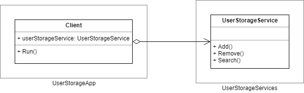

# UserStorage Project

The goal of this project is to create an easily configured distributed application that has open WCF API and communicates its state through the network.


UserStorage service is a simple service that stores user records and provides an API for managing user records and searching. It is possible to run several instances of this service and share user records between them. The only instance that allows READ and WRITE operations is called MASTER NODE. The other instances allow only READ operations. Those are known as SLAVE NODES. The only one READ operation in API is SEARCH, and there are two WRITE operations - ADD and REMOVE. That means UserStorage service can operate in two modes - MASTER and SLAVE. Responsibilities of the service in MASTER mode includes spreading the changes to all services that operate in SLAVE mode.

In other words, MASTER NODE accepts READ (SEARCH) and WRITE (ADD/REMOVE) operations, changes its state, and sends an update to all SLAVES NODE that accepts only READ (SEARCH) operations. If a client sends WRITE request to a SLAVE NODE, the node replies with an error.

Described approach when MASTER NODE owns original data and other SLAVE NODES have only the copy is knows [MASTER-SLAVE data replication](https://ruhighload.com/post/%D0%A0%D0%B5%D0%BF%D0%BB%D0%B8%D0%BA%D0%B0%D1%86%D0%B8%D1%8F+%D0%B4%D0%B0%D0%BD%D0%BD%D1%8B%D1%85). Possible solutions here are:
* MASTER NODE sends updates to all SLAVE NODES by himself.
* SLAVE NODES sends a request to MASTER NODE and MASTER replies with a bunch of updates.
* Other...

We recommend using the first approach, because we think that this solution is simpler that others.

Also, a MASTER NODE has a persistent storage for user record information when the application is not working. SLAVE NODES have only in-memory storage, and they do not save its state when they are not running. A persistent storage uses the file system to save user records when an application is shutting down and load them when it starts. A good question here is how to initialize the internal state of a SLAVE NODE when an application starts. The answer to this question is a part of the architectural design of this project.

A MASTER NODE sends updates to SLAVE NODES using TCP as a [transport channel](https://en.wikipedia.org/wiki/List_of_network_protocols_(OSI_model)#Layer_4_.28Transport_Layer.29) and [internet sockets](https://docs.microsoft.com/en-us/dotnet/api/system.net.sockets) as endpoints.

The one main thing about this project is that the final application should be configurable, and all application settings should be placed in App.config file. SLAVE NODE is the same application as a MASTER NODE except differences in application configuration file.


## Template

In the [UserStorage](UserStorage) folder you can find a solution template that you can use for building your own application. Let's take a look at the C# projects in the folder:

* [UserStorageApp](UserStorage/UserStorageApp) - a console application project with predefined [App.config](UserStorage/UserStorageApp/App.config). This project should not contain any service related code, only initialization and configuration logic. The configuration file has a custom section that is named _serviceConfiguration_. This section is for defining services configuration and settings. Visual Studio also provides IntelliSense support for this section because the section schema is defined in [ServiceConfiguration.xsd](UserStorage/UserStorageApp/ServiceConfiguration.xsd) file. 
* [UserStorageServices](UserStorage/UserStorageServices) - a class library project for all service related code.
* [UserStorageServices.Tests](UserStorage/UserStorageServices.Tests) - a class library project with all unit tests for service related behavior.
* [ServiceConfigurationSection](UserStorage/ServiceConfigurationSection) - a class library project that stores classes for handling _serviceConfiguration_ custom section in App.config.

UserStorage service operates over an entity that describes a user and has relevant name - [User class](UserStorage/UserStorageServices/User.cs) in UserStorageServices project. This class is pretty simple, and has FirstName, LastName and Age fields only.

```cs
class User
{
	public string FirstName { get; set; }

	public string LastName { get; set; }

	public int Age { get; set; }
}
```

UserStorageServices project also has [UserStorageService class](UserStorage/UserStorageServices/UserStorageService.cs) that is a template for UserStorage service you will be working with.

It is worth mentioning that this code is only the initial template - you are allowed not only to add new code, but also the code refactor it in a way you like.

We encourage you to practice TDD and actively use Git during this exersise. Here are some principles that might be useful for you:
* [Test First](http://www.extremeprogramming.org/rules/testfirst.html)
* [Red-Green-Refactor cycle](http://www.jamesshore.com/Blog/Red-Green-Refactor.html)
* [Do commit early and often](https://sethrobertson.github.io/GitBestPractices/#commit)
* [Branch-per-Feature](http://dymitruk.com/blog/2012/02/05/branch-per-feature/)


## Prepare

- [ ] Create a new repository on github. Move this README.md file and UserStorage folder from the master branch of this repository to your new repository.

- [ ] Install [StyleCop](https://github.com/StyleCop/StyleCop) or [Visual StyleCop](https://www.youtube.com/watch?v=0OMuzHRrScw). Open UserStorage solution and run StyleCop to check your code and to make sure that there are no code issues.

- [ ] Check unstaged files in your repository.

```sh
$ git status
```

- [ ] Add files to the staging area. Check status of staged files.

```sh
$ git add *
$ git status
```

- [ ] Commit and publish all changes. Check status. Publish changes to github.

```sh
$ git commit -m "Add UserStorage template."
$ git status
$ git push
```

Now you have initial version of your repository for the UserStorage project.


## Step 1

- [ ] Create a new branch

```sh
$ git checkout -b step1
Switched to a new branch "step1"
```




- [ ] Create a set of API methods for user storage service to support following operations:
  * Adding a new user to the user storage.
  * Removing an existed user from the user storage.
  * Search through all existed users in the user storage.

Each operation should have a name, a set of arguments and a result.

- [ ] Add an **Id** field to the _User_ class. The field value should uniqueily identify an user in the storage. When adding a new user the storage should evaluate a new unique value and assign it to user object.

- [ ] Arrange service operations as an interface methods. Use TDD approach and mocks to create unit tests for those methods and make sure that all possible cases are covered (think about error handling).

- [ ] Create a class for user storage service and implement the operations that were created on the previous step. Use ready unit tests to make sure that implementation covers all required functionality.

- [ ] Extract functionality that creates a unique identifier to a separate class, and refactor a storage service class to use the class for generating a new unique identifier.


## Step 2

- [ ] Add a persistent storage for storing the service's internal state.
  * Store all necessary information in XML file. Create an [appSettings section](https://msdn.microsoft.com/en-us/library/system.configuration.configurationmanager.appsettings(v=vs.110).aspx) in App.config file, and add a new key-value pair to store the file name.
  * The service should be able to store all user records that are added to user storage service to a file on disk using XML format.
  * The service should also store information about an unique identifier generation.
  * The service should be able to restore it's state using the provided persistent storage.

- [ ] Add logging functionality to log user service API calls.
  * Add a new [boolean switch](https://msdn.microsoft.com/en-us/library/system.diagnostics.booleanswitch%28v=vs.110%29.aspx) to _App.config_. If this switch is enabled all calls to API call should be logged.
  * You can use logging functionality from System.Diagnostics namespace. See more details in [TextWriterTraceListener](https://msdn.microsoft.com/ru-ru/library/system.diagnostics.textwritertracelistener(v=vs.110).aspx) MSDN article. You can also use NLog or other logging framework, but this is optional.


## Step 4

- [ ] Create a new class for an update notification to reflect the changes on MASTER NODE:
  * ADD event when a new user is added to the user storage service.
  * REMOVE event when an existed user is removed from the user storage service.

- [ ] Refactor the user storage service class to add an user service mode. The service should have only two modes: MASTER and SLAVE.
  * MASTER NODE should support all operations (add, remove, search), and have ability to use persistent storage.
  * SLAVE NODE should support only search operation, and it should throw an [user-defined exception](https://msdn.microsoft.com/en-us/library/87cdya3t(v=vs.110).aspx). SLAVE NODE should have no persitant storage, and the only way to change the service state should be to send the service a notification, a message with update information.

- [ ] Refactor infrastructure code: each instance of the user storage service class should be activated in a separate AppDomain. Both master and slave instances should be placed in a dedicated application domain.


- [ ] Refactor communication between instances to send update notifications to all SLAVE NODES about the changes on MASTER NODE.

- [ ] Use App.config to store the application service configuration. Use [custom configuration sections](https://habrahabr.ru/post/128517/) in App.config to bring more structure to your configuration file.


## Step 5

- [ ] Refactor the user storage service class to add new functionality to communicate over the network using TCP protocol:
  * For MASTER NODE - send update notifications to all registered SLAVE NODE endpoints.
  * For SLAVE NODE - listen to endpoint and receive update notifications from MASTER NODE.
  * Note: If you use the other communication approach for MASTER-SLAVE communication, those items wouldn't work for you.
  * Note: Use [NetworkStream](https://msdn.microsoft.com/ru-ru/library/system.net.sockets.networkstream%28v=vs.110%29.aspx), [TcpClient](https://msdn.microsoft.com/ru-ru/library/system.net.sockets.tcpclient(v=vs.110).aspx) and [TcpListener](https://msdn.microsoft.com/ru-ru/library/system.net.sockets.tcplistener(v=vs.110).aspx) or [Socket](https://msdn.microsoft.com/ru-ru/library/system.net.sockets.socket(v=vs.110).aspx) to establish communication channel between nodes.


- [ ] Use App.config to store the information about endpoints (hosts and ports) for all registered services.

- [ ] Refactor your application to ensure that your application can work in distributed mode:
  * There is at least one application with service configuration that works as MASTER node.
  * There are at least two applications with service configurations that work as SLAVE node.
  * There is no need to write code that synchronize MASTER and SLAVE nodes, just run the applications in the order you need.

