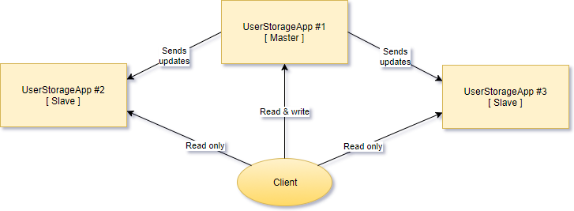
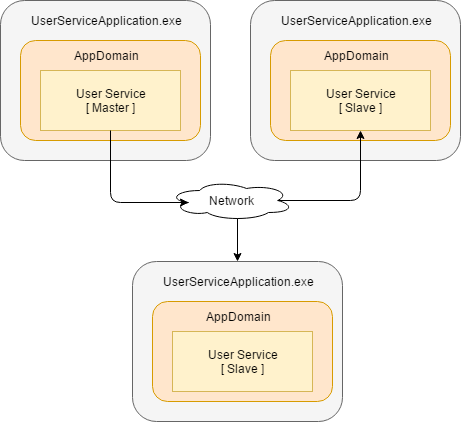

# UserStorage Project

The goal of this project is to create an easily configured distributed application that has open WCF API and communicates its state from the main part to dependent parts through the network.



* A UserStorage service is a simple service that stores user records and provides an API for managing user records and searching.
* A sample service is an UserService that provides storage and search functionality.
* The service in master mode (MASTER NODE) should handle READ and WRITE requests.
* The service in slave mode (SLAVE NODE) should only handle READ requests.
* The service in master mode should have a persistent storage for to save its internal state when an application is going offline, and to restore the state when an application is going online.
* There should be only one MASTER NODE, and there might be many SLAVE NODES.
* All nodes should communicate over the network using to send updates and receive incoming requests.
* The changes on the MASTER NODE should be delivered to all SLAVE NODES using [MASTER-SLAVE data replication](https://ruhighload.com/post/%D0%A0%D0%B5%D0%BF%D0%BB%D0%B8%D0%BA%D0%B0%D1%86%D0%B8%D1%8F+%D0%B4%D0%B0%D0%BD%D0%BD%D1%8B%D1%85).  The recommended approach is that MASTER NODE knows about all SLAVE NODES and sends them an update NOTIFICATIONS. Other approaches are also valid including [eventual consistency](https://en.wikipedia.org/wiki/Eventual_consistency).
* All application configuration settings should be stored in App.config file.


Let's start.

An user is represented by a User class, that has first and last name fields, and age.

```cs
class User
{
	public string FirstName { get; set; }

	public string LastName { get; set; }

	public int Age { get; set; }
}
```

## Step 1

- [ ] Create a set of API methods for user storage service to support following operations:
  * Adding a new user to the user storage.
  * Removing an existed user from the user storage.
  * Search through all existed users in the user storage.

Each operation should have a name, a set of arguments and a result.

- [ ] Add an **Id** field to the _User_ class. The field value should uniqueily identify an user in the storage. When adding a new user the storage should evaluate a new unique value and assign it to user object.

- [ ] Arrange service operations as an interface methods. Use TDD approach and mocks to create unit tests for those methods and make sure that all possible cases are covered (think about error handling).

- [ ] Install StyleCop and apply provided settings. Run StyleCop each time before committ.

- [ ] Create a class for user storage service and implement the operations that were created on the previous step. Use ready unit tests to make sure that implementation covers all required functionality.

- [ ] Extract functionality that creates a unique identifier to a separate class, and refactor a storage service class to use the class for generating a new unique identifier.


## Step 2

- [ ] Add a persistent storage for storing the service's internal state.
  * Store all necessary information in XML file. Create an [appSettings section](https://msdn.microsoft.com/en-us/library/system.configuration.configurationmanager.appsettings(v=vs.110).aspx) in App.config file, and add a new key-value pair to store the file name.
  * The service should be able to store all user records that are added to user storage service to a file on disk using XML format.
  * The service should also store information about an unique identifier generation.
  * The service should be able to restore it's state using the provided persistent storage.

- [ ] Add logging functionality to log user service API calls.
  * Add a new [boolean switch](https://msdn.microsoft.com/en-us/library/system.diagnostics.booleanswitch%28v=vs.110%29.aspx) to _App.config_. If this switch is enabled all calls to API call should be logged.
  * You can use logging functionality from System.Diagnostics namespace. See more details in [TextWriterTraceListener](https://msdn.microsoft.com/ru-ru/library/system.diagnostics.textwritertracelistener(v=vs.110).aspx) MSDN article. You can also use NLog or other logging framework, but this is optional.


## Step 4

- [ ] Create a new class for an update notification to reflect the changes on MASTER NODE:
  * ADD event when a new user is added to the user storage service.
  * REMOVE event when an existed user is removed from the user storage service.

- [ ] Refactor the user storage service class to add an user service mode. The service should have only two modes: MASTER and SLAVE.
  * MASTER NODE should support all operations (add, remove, search), and have ability to use persistent storage.
  * SLAVE NODE should support only search operation, and it should throw an [user-defined exception](https://msdn.microsoft.com/en-us/library/87cdya3t(v=vs.110).aspx). SLAVE NODE should have no persitant storage, and the only way to change the service state should be to send the service a notification, a message with update information.

- [ ] Refactor infrastructure code: each instance of the user storage service class should be activated in a separate AppDomain. Both master and slave instances should be placed in a dedicated application domain.


- [ ] Refactor communication between instances to send update notifications to all SLAVE NODES about the changes on MASTER NODE.

- [ ] Use App.config to store the application service configuration. Use [custom configuration sections](https://habrahabr.ru/post/128517/) in App.config to bring more structure to your configuration file.


## Step 5

- [ ] Refactor the user storage service class to add new functionality to communicate over the network using TCP protocol:
  * For MASTER NODE - send update notifications to all registered SLAVE NODE endpoints.
  * For SLAVE NODE - listen to endpoint and receive update notifications from MASTER NODE.
  * Note: If you use the other communication approach for MASTER-SLAVE communication, those items wouldn't work for you.
  * Note: Use [NetworkStream](https://msdn.microsoft.com/ru-ru/library/system.net.sockets.networkstream%28v=vs.110%29.aspx), [TcpClient](https://msdn.microsoft.com/ru-ru/library/system.net.sockets.tcpclient(v=vs.110).aspx) and [TcpListener](https://msdn.microsoft.com/ru-ru/library/system.net.sockets.tcplistener(v=vs.110).aspx) or [Socket](https://msdn.microsoft.com/ru-ru/library/system.net.sockets.socket(v=vs.110).aspx) to establish communication channel between nodes.


- [ ] Use App.config to store the information about endpoints (hosts and ports) for all registered services.

- [ ] Refactor your application to ensure that your application can work in distributed mode:
  * There is at least one application with service configuration that works as MASTER node.
  * There are at least two applications with service configurations that work as SLAVE node.
  * There is no need to write code that synchronize MASTER and SLAVE nodes, just run the applications in the order you need.

